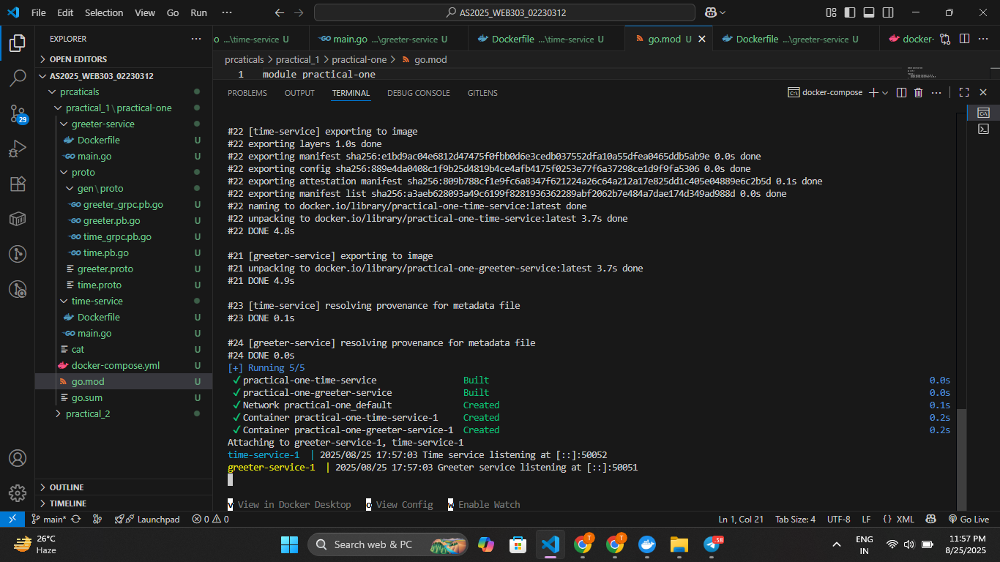
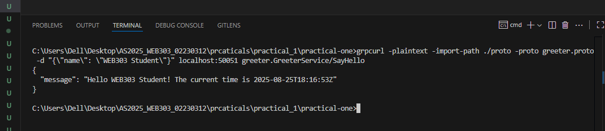

---

### **Module:** WEB303 – Microservices & Serverless Applications

### **Practical:** 1 – Development Environment Setup & Inter-Service Communication


---

## **1. Objective**

The goal of this practical was to set up a working environment for microservice development using **Go, gRPC, Protocol Buffers, and Docker**. Then, I implemented two microservices (Greeter and Time services) that communicate with each other using gRPC and are orchestrated together using Docker Compose.

This supports the following learning outcomes:

* **LO2:** Design and implement microservices using gRPC and Protocol Buffers.
* **LO6:** Understand deployment with Docker as a foundation for Kubernetes.
* **LO1 (supported):** Explain microservices concepts and benefits.

---

## **2. Work Completed**

### **2.1 Environment Setup**

* Installed **Go** and configured environment variables (`go version` verified).
* Installed **Protocol Buffers (protoc)** and gRPC Go plugins.
* Installed and tested **Docker Desktop** with the `hello-world` container.

---

### **2.2 Service Contracts (Protobuf)**

* Created two `.proto` files:

  * **time.proto** → Defines `TimeService` with `GetTime()` RPC to return the current time.
  * **greeter.proto** → Defines `GreeterService` with `SayHello()` RPC to return a greeting.
* Generated Go code using `protoc`, producing four `.go` files in `proto/gen`.

---

### **2.3 Microservice Implementation**

* **Time Service (time-service):**

  * gRPC server that listens on port `50052`.
  * Implements `GetTime()` which returns the current system time in RFC3339 format.

* **Greeter Service (greeter-service):**

  * gRPC server that listens on port `50051`.
  * Acts as a **client** to the time-service.
  * `SayHello(name)` → Calls time-service, fetches current time, and returns greeting message with time.

---

### **2.4 Containerization & Orchestration**

* Created **Dockerfiles** for both services (multi-stage builds using Go and Alpine).
* Created **docker-compose.yml** to run both services in one network.

  * `time-service` runs on port `50052`.
  * `greeter-service` runs on port `50051` and depends on time-service.

---

### **2.5 Testing**

* Started both containers with:

  ```bash
  docker-compose up --build
  ```
  

* Used **grpcurl** to test greeter-service endpoint:

  ```bash
  grpcurl -plaintext -import-path ./proto -proto greeter.proto \
    -d '{"name": "WEB303 Student"}' \
    0.0.0.0:50051 greeter.GreeterService/SayHello
  ```
    
* **Output received (example):**

  ```json
  {
    "message": "Hello WEB303 Student! The current time is 2025-07-24T09:45:00Z"
  }
  ```
  

---

## **3. Challenges Encountered**

* Needed to ensure the `go_package` paths in proto files matched project structure.
* Faced minor issues with protoc command paths, solved by running from root directory.
* Learned that service discovery in Docker works automatically by using the service name (`time-service`) as hostname.

---

## **4. Conclusion**

In this practical, I successfully:

* Set up the environment with Go, gRPC, Protobuf, and Docker.
* Implemented two microservices (time-service and greeter-service).
* Used gRPC for inter-service communication.
* Containerized both services and orchestrated them using Docker Compose.
* Verified functionality with grpcurl and received the correct greeting message with the current time.

This exercise provided a strong foundation in microservices development, inter-service communication, and container-based deployment.

---
