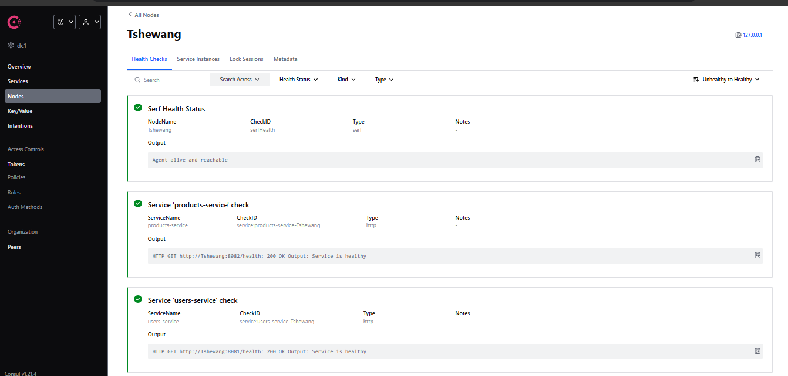
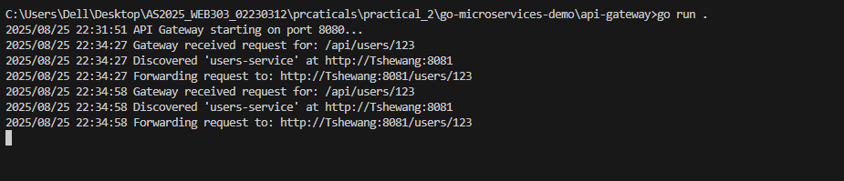
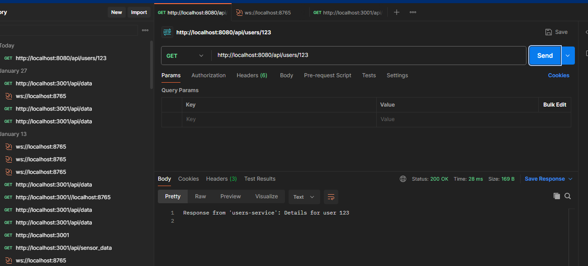
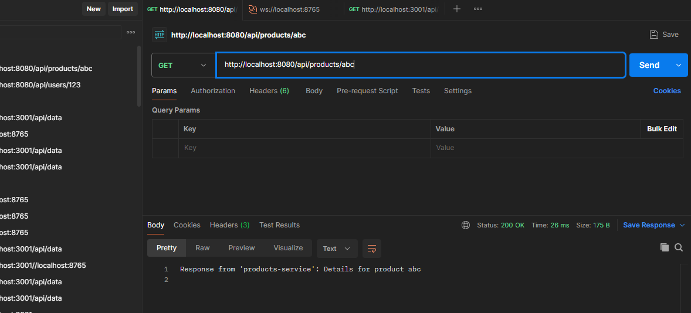

**Module:** WEB303 Microservices & Serverless Applications

**Practical 2:** API Gateway with Service Discovery

---

## 1. Objective

The aim of this practical was to implement a small microservices ecosystem using **Consul** for service discovery and an **API Gateway** for routing requests. Two independent services (`users-service` and `products-service`) were created, registered with Consul, and made accessible through a single gateway.

This demonstrates how service discovery enables decoupled, resilient, and scalable architectures.

---

## 2. Tools & Technologies Used

* **Programming Language:** Go (v1.21)
* **Frameworks/Libraries:**

  * Chi Router (`github.com/go-chi/chi/v5`)
  * Consul API Client (`github.com/hashicorp/consul/api`)
* **Service Registry:** HashiCorp Consul
* **Containerisation (optional):** Docker & Docker Compose
* **Testing Tools:** cURL & Postman

---

## 3. Steps Performed

### Step 1: Environment Setup

* Installed Go and verified with `go version`.
* Installed Docker Desktop and verified with `docker --version`.
* Installed Consul (initially tried with Docker, then switched to running Consul locally to avoid host-network issues).

---

### Step 2: Project Structure

Created the following project directories:

```
go-microservices-demo/
├── api-gateway/
│   └── main.go
└── services/
    ├── products-service/
    │   └── main.go
    └── users-service/
        └── main.go
```

---

### Step 3: Users Service

* Built `users-service` running on **port 8081**.
* Added `/users/{id}` endpoint to fetch user details.
* Registered with Consul and added `/health` endpoint for health checks.

---

### Step 4: Products Service

* Built `products-service` running on **port 8082**.
* Added `/products/{id}` endpoint to fetch product details.
* Registered with Consul and added `/health` endpoint for health checks.

---

### Step 5: API Gateway

* Built an **API Gateway** running on **port 8080**.
* Configured it to route requests:

  * `/api/users/*` → `users-service`
  * `/api/products/*` → `products-service`
* Implemented Consul client for service discovery to fetch healthy instances dynamically.

---

### Step 6: Running the System

* Started **Consul agent** locally using:

  ```bash
  consul agent -dev
  ```
* Ran `users-service` → Verified registration in Consul UI.
* Ran `products-service` → Verified registration in Consul UI.
* Ran `api-gateway` → Successfully routed requests.

**Testing with cURL:**

```bash
curl http://localhost:8080/api/users/123
# Response from 'users-service': Details for user 123

curl http://localhost:8080/api/products/abc
# Response from 'products-service': Details for product abc
```

---

### Step 7: Resilience Demonstration

* Stopped `users-service`.
* Consul UI updated its health check to **critical**.
* Gateway returned:

  ```
  no healthy instances of service 'users-service' found in Consul
  ```
* Restarted `users-service` and it became available again without restarting the gateway.

---

## 4. Challenges Faced

* Initially, the services registered to Consul running inside Docker, but the gateway (running on host) couldn’t resolve them.
* Fixed this by **running Consul locally** instead of Docker, which allowed smooth service discovery.

---

## 5. Screenshots

* Consul UI showing both services registered and healthy.
* Postman/cURL requests hitting the gateway.
* API Gateway terminal logs showing routing decisions.




### Users Services 


### Product Services


---

## 6. Conclusion

This practical helped me understand how **API Gateway + Service Discovery** patterns work in microservices. Using Consul made it possible to dynamically discover services, monitor health, and keep the system resilient without hardcoding service locations.

The key takeaway: Microservices can be **independent, scalable, and fault-tolerant** when combined with service discovery and gateway patterns.

---


