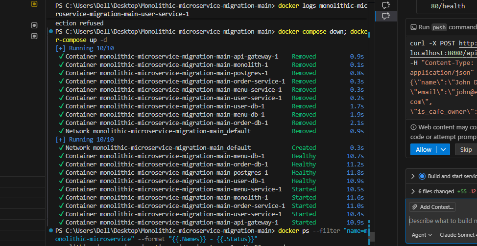
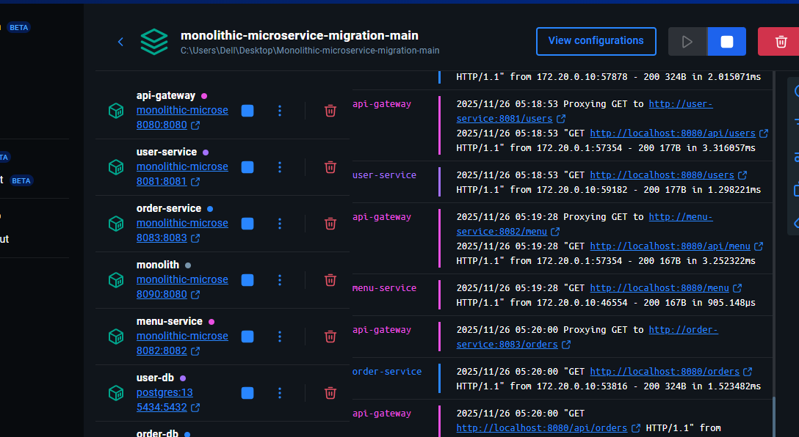
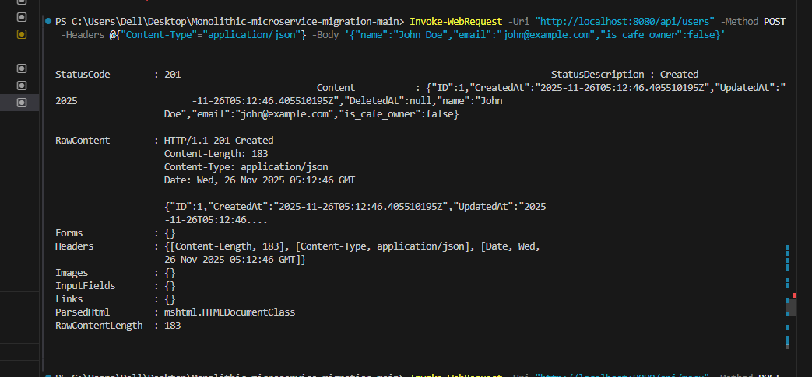
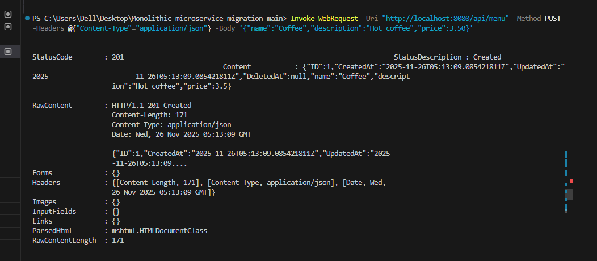
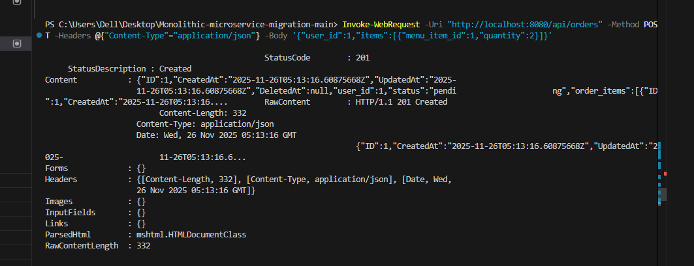
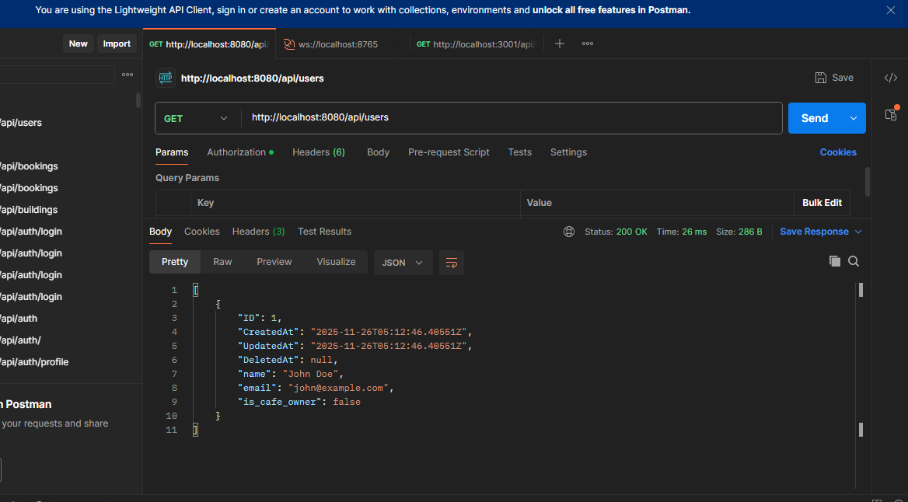
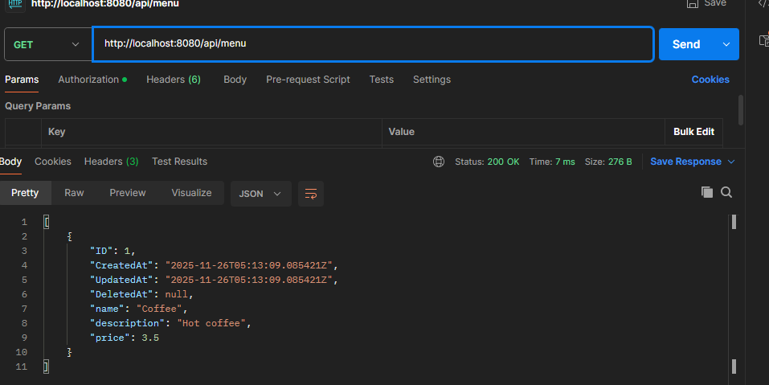
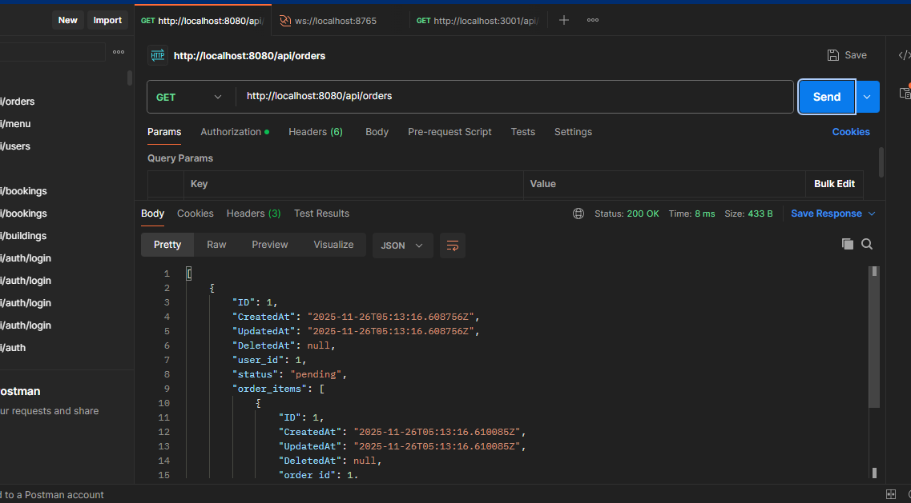

# Student Cafe - Microservices Architecture


# **WEB303 — Practical 5: Refactoring a Monolithic Web Server to Microservices**

## **1. Objective**

This practical teaches you how to refactor a monolithic Student Café application into multiple microservices. You will identify domain boundaries, extract independent services, restructure the codebase, manage distributed data, implement service discovery, and orchestrate services using Docker Compose.

This practical builds on:

* **Practical 2** (Consul + API Gateway)
* prepares you for future topics such as **gRPC**, **Kubernetes**, and **production microservices**

---

## **2. Learning Outcomes**

By completing this practical, you will be able to:

1. **Differentiate monoliths vs. microservices**—their characteristics, benefits, and trade-offs.
2. **Apply Domain-Driven Design (DDD)** to identify domain boundaries and service ownership.
3. **Refactor a monolith step-by-step** into multiple microservices while keeping the system functional.
4. **Implement service discovery** using Consul in a microservices ecosystem.
5. **Containerize and orchestrate services** with Docker Compose.
6. Understand how this architecture evolves toward **gRPC** and **Kubernetes**.

---

## **3. Why This Practical Matters**

Many companies migrate from monolithic systems to microservices. Therefore, you must understand:

### **Technical Decision Making**

When it is beneficial to extract a service from the monolith.

### **Risk Management**

How to refactor incrementally without breaking the entire system.

### **System Design**

Clean service boundaries prevent tight coupling and allow independent deployment.

### **Career Importance**

Microservices architecture is widely used in modern backend engineering.

---

## **4. Part 1 — Understanding Service Boundaries**

Before extracting microservices, we must fully understand the domain.

## **4.1 Domain-Driven Design (DDD) Concepts**

### **1. Bounded Contexts**

A bounded context defines a clear boundary where a specific domain model applies.

For **Student Café**, we have:

| Context           | Description                                |
| ----------------- | ------------------------------------------ |
| **User Context**  | Registration, authentication, user profile |
| **Menu Context**  | Menu items, food descriptions, pricing     |
| **Order Context** | Cart, checkout, order history              |

Each becomes an independent service.

---

### **2. Low Coupling, High Cohesion**

* **High Cohesion:** menu items + prices change together → same service
* **Low Coupling:** menu service should not depend directly on user or order schemas

---

### **3. Entities & Aggregates**

| Entity    | Identifier    |
| --------- | ------------- |
| User      | user_id       |
| MenuItem  | menu_item_id  |
| Order     | order_id      |
| OrderItem | order_item_id |

**Aggregate Example:**
`Order` aggregate includes its list of `OrderItems`.

Rule: **Each aggregate belongs to exactly one service.**

---

### **4. Business Capabilities**

Ask: **“What does the business need to do?”**

| Capability     | Service       |
| -------------- | ------------- |
| Manage users   | user-service  |
| Manage menu    | menu-service  |
| Process orders | order-service |

This becomes the **microservices decomposition strategy**.

---

## **5. Part 2 — Build the Monolith (Baseline System)**

Before decomposition, create a fully working monolith including:

* models
* handlers
* single shared database
* single deployment unit

This gives us:

✓ baseline functionality
✓ debugging simplicity
✓ a system to gradually refactor

---

## **6. Monolithic Architecture Setup**

### **Services inside one codebase**

* Users
* Menu items
* Orders (with snapshot pricing)

### **Characteristics of the monolith**

* Single PostgreSQL database
* All handlers in one Go app
* Tight coupling between user, menu, and order handlers
* Works correctly but is hard to scale or update independently

This baseline is **important before extraction**.

---

## **7. Part 3 — Extracting the Menu Service**

Why extract the menu service first?

1. **Easy to isolate** — no dependencies on users or orders
2. **Low risk** — mostly read operations
3. **High-volume traffic** — menu browsing
4. **Database-safe** — its table can live in its own DB

then created:

```
menu-service/
├── main.go
├── models/
├── handlers/
├── database/
└── Dockerfile
```

This service now:

* Has its **own database**
* Owns the **MenuItem** entity exclusively
* Exposes `/menu` routes independently
* Can scale without affecting users or orders

---


This project demonstrates a migration from a monolithic architecture to microservices for a student cafe application.

## Architecture

The application is split into the following microservices:

- **API Gateway** (Port 8080) - Routes requests to appropriate microservices
- **User Service** (Port 8081) - Manages user data
- **Menu Service** (Port 8082) - Manages menu items
- **Order Service** (Port 8083) - Manages orders and orchestrates between user and menu services
- **Monolith** (Port 8090) - Original monolithic application for comparison

Each microservice has its own dedicated PostgreSQL database.

## Quick Start

### Prerequisites
- Docker
- Docker Compose

### Running the Application

1. Start all services:
```bash
docker-compose up -d
```


2. Check service status:
```bash
docker-compose ps
```
Docker Services Running



3. View logs:
```bash
docker-compose logs -f
```

4. Stop all services:
```bash
docker-compose down
```

## API Endpoints

All requests go through the API Gateway at `http://localhost:8080`

### User Service (`/api/users`)

- **Create User**
  ```bash
  POST /api/users
  Body: {"name": "John Doe", "email": "john@example.com", "is_cafe_owner": false}
  ```

- **Get All Users**
  ```bash
  GET /api/users
  ```

- **Get User by ID**
  ```bash
  GET /api/users/{id}
  ```

### Menu Service (`/api/menu`)

- **Create Menu Item**
  ```bash
  POST /api/menu
  Body: {"name": "Coffee", "description": "Hot coffee", "price": 3.50}
  ```

- **Get All Menu Items**
  ```bash
  GET /api/menu
  ```

- **Get Menu Item by ID**
  ```bash
  GET /api/menu/{id}
  ```

### Order Service (`/api/orders`)

- **Create Order**
  ```bash
  POST /api/orders
  Body: {"user_id": 1, "items": [{"menu_item_id": 1, "quantity": 2}]}
  ```

- **Get All Orders**
  ```bash
  GET /api/orders
  ```

- **Get Order by ID**
  ```bash
  GET /api/orders/{id}
  ```

## Example Usage

### PowerShell Examples


# Create a user
Invoke-WebRequest -Uri "http://localhost:8080/api/users" -Method POST -Headers @{"Content-Type"="application/json"} -Body '{"name":"John Doe","email":"john@example.com","is_cafe_owner":false}'


# Create a menu item
Invoke-WebRequest -Uri "http://localhost:8080/api/menu" -Method POST -Headers @{"Content-Type"="application/json"} -Body '{"name":"Coffee","description":"Hot coffee","price":3.50}'


# Create an order
Invoke-WebRequest -Uri "http://localhost:8080/api/orders" -Method POST -Headers @{"Content-Type"="application/json"} -Body '{"user_id":1,"items":[{"menu_item_id":1,"quantity":2}]}'


# Get all users
Invoke-WebRequest -Uri "http://localhost:8080/api/users" -Method GET | Select-Object -ExpandProperty Content


# Get all menu items
Invoke-WebRequest -Uri "http://localhost:8080/api/menu" -Method GET | Select-Object -ExpandProperty Content

# Get all orders
Invoke-WebRequest -Uri "http://localhost:8080/api/orders" -Method GET | Select-Object -ExpandProperty Content

```

## Database Ports

- **postgres** (Monolith): 5432
- **user-db**: 5434
- **menu-db**: 5433
- **order-db**: 5435

## Health Checks

- API Gateway: `http://localhost:8080/health`
- User Service: `http://localhost:8081/health`
- Menu Service: `http://localhost:8082/health`
- Order Service: `http://localhost:8083/health`

## Service Communication

The Order Service communicates with:
- **User Service** - to validate user exists before creating an order
- **Menu Service** - to validate menu items and capture prices at order time

All inter-service communication happens via HTTP.

## Development

### Building Individual Services


# Build user service
docker-compose build user-service

# Build menu service
docker-compose build menu-service

# Build order service
docker-compose build order-service

# Build api-gateway
docker-compose build api-gateway
```

### Viewing Logs

```bash
# All services
docker-compose logs -f

# Specific service
docker-compose logs -f user-service
docker-compose logs -f menu-service
docker-compose logs -f order-service
docker-compose logs -f api-gateway
```

## Troubleshooting

1. **Services fail to start**: Make sure no other services are using ports 8080-8090 or 5432-5435

2. **Database connection errors**: The services use healthchecks to wait for databases to be ready. If issues persist, check database logs:
   ```bash
   docker-compose logs user-db
   docker-compose logs menu-db
   docker-compose logs order-db
   ```

3. **Clean restart**: To completely reset the application:
   ```bash
   docker-compose down -v
   docker-compose up -d
   ```
   (Note: `-v` removes volumes, which will delete all data)

## Technology Stack

- **Language**: Go 1.23
- **Web Framework**: Chi v5
- **ORM**: GORM
- **Database**: PostgreSQL 13
- **Containerization**: Docker & Docker Compose

Inter-Service Communication Logs
