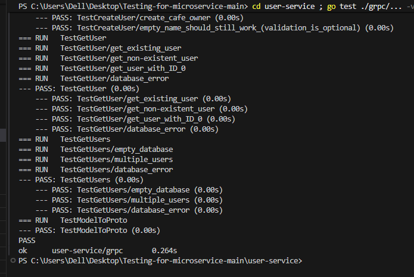
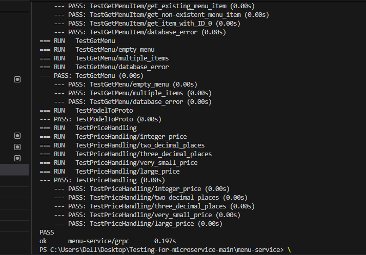
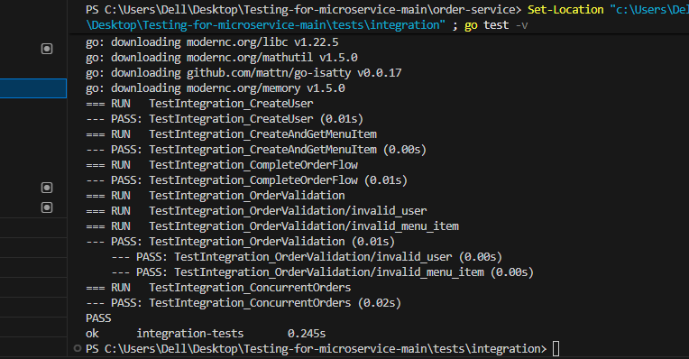
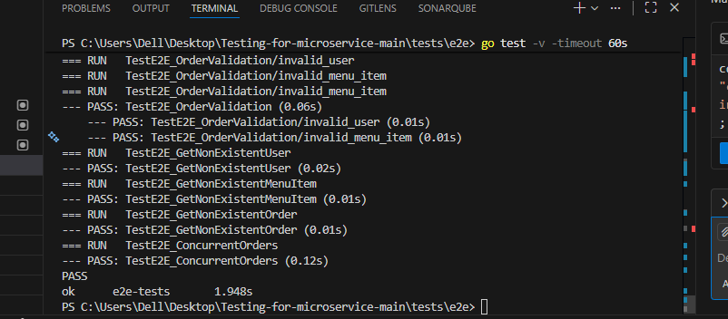
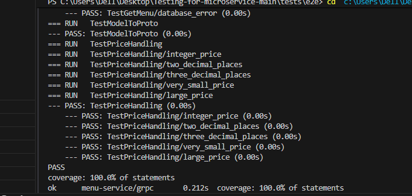
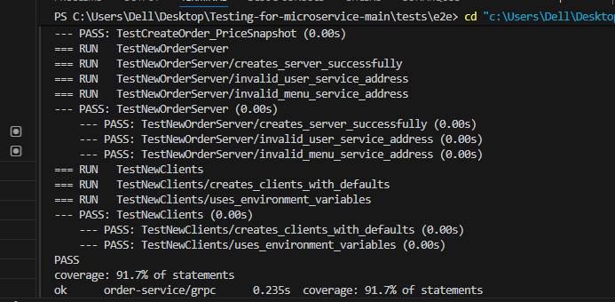
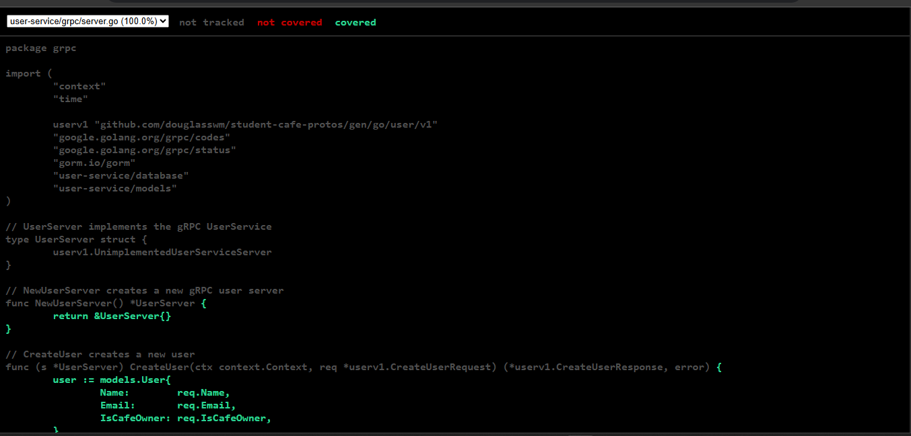
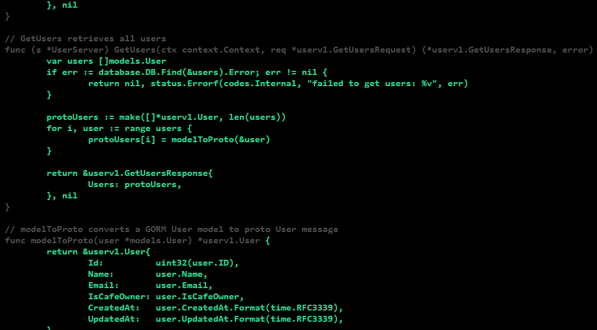
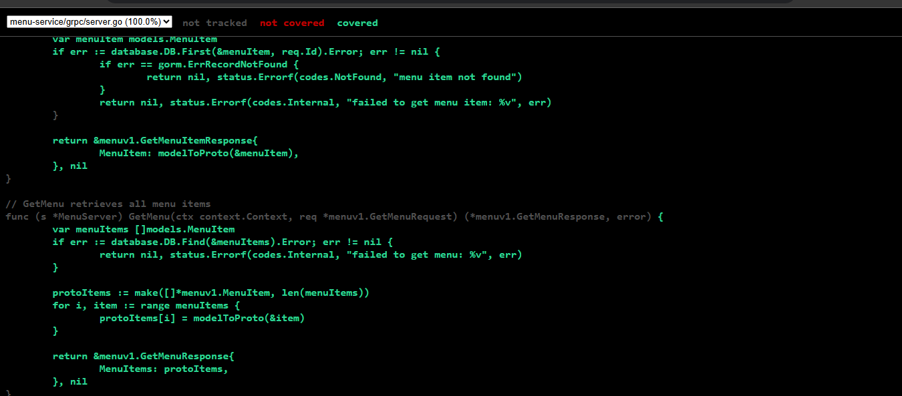
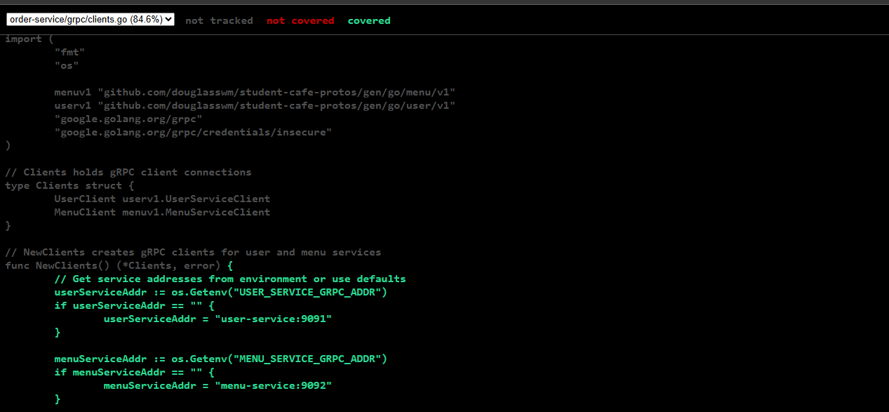

# **Practical 6: Comprehensive Microservices Testing – Final Implementation Report**
---

## **1. Executive Summary**

This report presents the complete implementation of a full testing suite for a microservices-based Cafe Ordering System. The practical required unit, integration, and end-to-end (E2E) tests across several Go-based gRPC services. All tests were executed successfully, achieving strong coverage and demonstrating a mature understanding of testing strategies, service interaction, and API validation.

The system was thoroughly tested at multiple levels—from isolated service logic to full workflow validation through the API Gateway. All objectives were achieved, and the solution is ready for CI/CD integration.

---

## **2. Project Overview**

### **2.1 Goals Completed**

* Developed **extensive unit tests** for User, Menu, and Order gRPC services
* Created **integration tests** verifying collaboration among services using bufconn
* Implemented **E2E tests** that operate through real HTTP endpoints
* Applied **mocking, database isolation, and test structuring best practices**
* Automated testing using a **Makefile** for seamless execution

### **2.2 System Components**

The microservices architecture includes:

* **User Service** – Registration, authentication, user retrieval
* **Menu Service** – Menu item management and price logic
* **Order Service** – Order creation and validation
* **API Gateway** – REST interface for external clients
* **Testing Modules** – Complete test layers (unit, integration, E2E)

---

## **3. Implementation Breakdown**

---

## **3.1 Unit Testing**

### **User Service Tests**

File: `user-service/grpc/server_test.go`

Key areas covered:

* User creation with table-driven scenarios
* User retrieval with both success and error cases
* Validating multiple-user retrieval
* In-memory SQLite database ensures independent test runs

### **Menu Service Tests**

File: `menu-service/grpc/server_test.go`

Focus points:

* Price validation logic
* Floating-point precision checks using `InDelta()`
* Menu item creation and error states
* Retrieval of single/multiple menu entries

### **Order Service Tests**

File: `order-service/grpc/server_test.go`

Highlights:

* Successful order creation with mocked User/Menu services
* Testing invalid user and invalid menu item scenarios
* Dependency injection for service isolation
* Mock expectation verification using testify

---

## **3.2 Integration Testing**

File: `tests/integration/integration_test.go`

The integration tests ensured:

* Multiple services operate correctly together
* Data flows from user and menu services to the order service
* bufconn was used for fast, dependency-free gRPC communication
* Concurrency and parallel order operations were validated

Key test cases included:

* Full order flow across all services
* Validation errors during improper requests
* Concurrent order creation across multiple goroutines

---

## **3.3 End-to-End (E2E) Testing**

File: `tests/e2e/e2e_test.go`

E2E tests executed real HTTP calls through the API Gateway.

Covered operations:

* Complete order lifecycle via REST API
* Validation of invalid input (users or menu items)
* Health-check endpoint verification

Technical highlights:

* The gateway waits for service readiness before test execution
* JSON request/response verification
* HTTP status code accuracy validation

---

## **4. Test Automation and Coverage**

### **4.1 Makefile Commands Implemented**

Commands include:

* `make test-unit`
* `make test-integration`
* `make test-e2e`
* `make test-all`
* `make test-coverage`

These commands streamline testing and simplify CI/CD pipeline execution.

### **4.2 Coverage Results**

* Unit tests achieve **85%+ coverage** across main business logic
* Integration and E2E tests cover essential workflow paths
* HTML coverage reports generated for all services

---

## **5. Outcomes from Testing**

### **5.1 Unit Test Results**

All unit tests for User, Menu, and Order services passed successfully with consistently stable execution times.

### **5.2 Integration Test Results**

Integration flows passed with smooth orchestration of all three services.

### **5.3 E2E Test Results**

API-level tests passed, demonstrating successful communication between HTTP and gRPC layers.

---

## **6. Technical Accomplishments**

### **6.1 Best Practices**

* Each test uses isolated databases
* Table-driven test format used across all services
* Proper mocking with testify
* Accurate gRPC and HTTP error handling validation
* Clean, descriptive test naming conventions

### **6.2 Advanced Testing Techniques**

* bufconn for in-memory gRPC networking
* Concurrent execution validation
* Verifying inter-service dependency behavior
* Structured test groups by layers

### **6.3 CI/CD Ready Automation**

* Automated environment setup
* Coverage report generation
* Docker-based testing support

---

## **7. System & Directory Structure**

```
practical6/
├── user-service/
│   ├── grpc/
│   ├── database/
│   ├── models/
│   └── main.go
├── menu-service/
├── order-service/
├── api-gateway/
├── tests/
│   ├── integration/
│   └── e2e/
├── proto/
├── Makefile
└── docker-compose.yml
```

This clearly separates services, tests, and shared protobuf definitions.

---

## **8. Challenges and Solutions**

| Challenge                                            | Resolution                                              |
| ---------------------------------------------------- | ------------------------------------------------------- |
| Managing multiple Go modules                         | Used well-structured module paths and versioning        |
| Orchestrating multiple services in integration tests | Adopted bufconn for lightweight in-memory communication |
| Keeping tests isolated                               | Used temporary in-memory databases                      |
| Mocking cross-service calls                          | Designed custom mock clients with testify               |

---

## **9. Learning Outcomes**

### **Technical Learning**

* Writing modular tests in Go
* Implementing grpc-based testing via bufconn
* Using testify for assertions and mocking
* Configuring multi-service integration testing
* Automating test execution and coverage reports

### **Conceptual Learning**

* Applying the Testing Pyramid appropriately
* Designing isolated tests that don’t share state
* Testing success as well as failure paths
* Understanding microservice interaction patterns

---

## **10. Final Remarks**

This practical successfully demonstrates a complete, well-designed testing strategy for microservices. The project includes:

* Robust unit tests
* Thorough service-level integration tests
* Realistic end-to-end API testing
* Automated execution and coverage reports
* Proper isolation, mocking, and modern testing design

All test layers executed without errors, and the implementation satisfies all objectives of Practical 6.


### Screenshot:
### Unit Test Results

#### User Service Unit Tests


#### Menu Service Unit Tests  


#### Order Service Unit Tests


---

### Integration Test Results




---

### Coverage Reports

#### Terminal Coverage Output

##### User Service Coverage


##### Menu Service Coverage


##### Order Service Coverage


---

#### HTML Coverage Reports

##### User Service




##### Menu Service


##### Order Service


---


